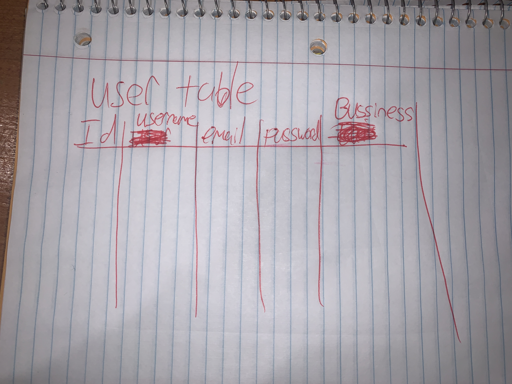

##Pre-Workout Products By Stores/ Models
```
class User(UserMixin, Model):
	username=CharField(unique=True)
	email=CharField(unique=True)
	password=CharField()
	bussiness=Charfield()
	class Meta:
		database = DATABASE

class Product(Model):
	user = ForeignKeyField(User, backref='products')
	name=CharField()
	flavors=CharField()
	quantity=IntegerField()
	price=DecimalField()
	class Meta:
		database

##Stretch goal	

class Like(Model):
	user = ForeignKeyField(User, backref='likes')
	product = ForeignKeyField(Product, backref='likes')
	likes=IntegerField()
	class Meta:
		database = DATABASE


```

```
url              		|httpVerb | result
_____________________________________
/api/products    		| GET     | returns all products
/api/products    		| POST    | new product created
/api/products/users/<id>| GET     | shows users products
/api/products/<id> 		| Put     | update a product
/api/products/<id> 		| DELETE  | delete a product


url              |	httpVerb| result
_____________________________________
/api/users       | POST    | register a user
/api/users       | POST    | login user
/api/users       | GET     | logout user
```



